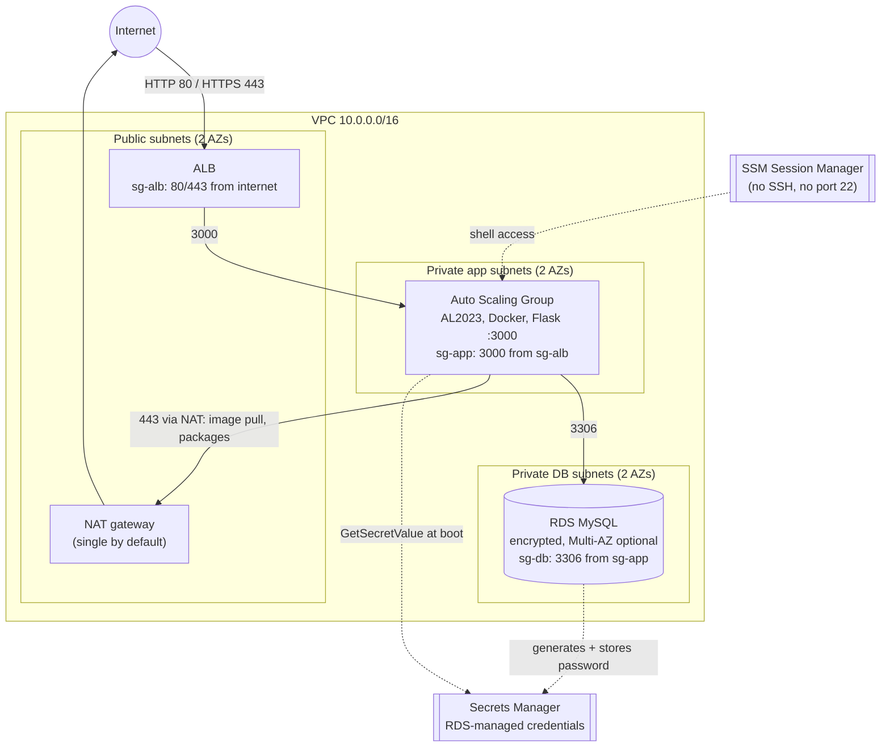

# aws-terraform-3tier

[](https://github.com/frenzyali/aws-terraform-3tier/actions/workflows/terraform.yml)

Production-style 3-tier AWS infrastructure in Terraform (VPC, ALB, Auto Scaling Group, RDS MySQL, remote state) that hosts the app from my [3-tier-app-deployment](https://github.com/frenzyali/3-tier-app-deployment) repo.

> **Status:** validated and scanned in CI (`fmt`, `validate`, `tflint`, `checkov`), but **not yet applied to a real AWS account**. See [Known limitations](#known-limitations).

## Architecture



Security groups are chained: **internet → ALB → app → DB**. Nothing else is open. The DB subnets have no route to the internet at all.

## Stack

| Layer | Tech |
|---|---|
| Network | VPC, 2 AZs, public / private-app / private-db subnets, IGW, optional NAT, flow logs |
| Web | Application Load Balancer, optional HTTPS via ACM |
| App | Auto Scaling Group, launch template, Amazon Linux 2023, Docker (the Flask app from the companion repo) |
| Data | RDS MySQL 8.4, credentials in Secrets Manager |
| State | S3 (versioned, encrypted) + DynamoDB lock table, created by `bootstrap/` |
| Tooling | Terraform `~> 1.9`, AWS provider `~> 6.0`, tflint, checkov, gitleaks, pre-commit, GitHub Actions |

## What it demonstrates

- **Modular Terraform:** four reusable modules (`network`, `alb`, `asg`, `rds`) with typed, documented, validated variables, composed by a thin root module.
- **Least-privilege networking:** chained security-group references instead of CIDRs, private subnets per tier, and a DB route table with no internet route.
- **No long-lived secrets:** the RDS master password is generated by RDS into Secrets Manager and read at boot with an instance role; it never appears in variables, state outputs or the repo.
- **Hardened compute:** IMDSv2 required, hop limit 1, encrypted root volume, SSM access only, no key pair, no port 22.
- **Safe remote state:** a separate bootstrap stack creates a versioned, encrypted, TLS-only state bucket with public access blocked and a DynamoDB lock table.
- **Credential-free CI:** every PR runs `fmt`, `validate`, `tflint` and `checkov` with no cloud credentials, and checkov findings fail the build.

## Prerequisites

- Terraform `>= 1.9` (developed with 1.16)
- An AWS account and credentials in your shell (`AWS_PROFILE` or standard env vars). Only needed to plan or apply; the checks below need none.
- For local checks: [tflint](https://github.com/terraform-linters/tflint), [checkov](https://www.checkov.io/), [gitleaks](https://github.com/gitleaks/gitleaks), and optionally [pre-commit](https://pre-commit.com/).
- The app image from the companion repo published to a registry (the example uses a placeholder `your-dockerhub-user/3tier-app`).

## Quick start

```bash
git clone https://github.com/frenzyali/aws-terraform-3tier.git
cd aws-terraform-3tier

# 1. Create remote state (once per account). Pick a globally unique bucket name.
cd bootstrap
cp terraform.tfvars.example terraform.tfvars   # edit state_bucket_name
terraform init
terraform apply
terraform output                               # note the bucket and lock table names
cd ..

# 2. Point the main stack at that state.
cp backend.tf.example backend.tf               # fill in the bucket name from step 1

# 3. Configure and plan dev.
cp envs/dev/terraform.tfvars.example envs/dev/terraform.tfvars   # set app_image
terraform init
terraform plan -var-file=envs/dev/terraform.tfvars
```

`terraform apply -var-file=envs/dev/terraform.tfvars` creates the environment. Once the instances are healthy, `curl http://$(terraform output -raw alb_dns_name)/health` should return `{"status":"ok"}`.

Run the same checks as CI, with no credentials:

```bash
make check      # fmt, validate, tflint, checkov
```

### Switching to prod

Use `envs/prod/terraform.tfvars.example` the same way, and set `key = "prod/terraform.tfstate"` in `backend.tf` so dev and prod never share state. After changing the key, run `terraform init -reconfigure`.

## Project layout

```text
.
├── bootstrap/                 # separate stack: S3 state bucket + DynamoDB lock table (local state)
├── modules/
│   ├── network/               # VPC, subnets, IGW, NAT, route tables, flow logs
│   ├── alb/                   # ALB, listeners, target group, ALB security group
│   ├── asg/                   # launch template, ASG, IAM role, app security group, user data
│   └── rds/                   # RDS MySQL, subnet group, DB security group
├── envs/
│   ├── dev/terraform.tfvars.example
│   └── prod/terraform.tfvars.example
├── main.tf                    # composes the modules and wires the SG chain
├── variables.tf  outputs.tf  providers.tf  versions.tf
├── backend.tf.example         # copy to backend.tf after bootstrap
├── terraform.tfvars.example   # same as the dev example
├── .github/workflows/terraform.yml
├── .tflint.hcl  .pre-commit-config.yaml  .editorconfig  Makefile
└── LICENSE
```

## Design decisions

| Decision | Why | Trade-off |
|---|---|---|
| **Single NAT gateway by default** (`single_nat_gateway = true`) | A NAT gateway is the largest fixed cost in a small environment; one shared NAT cuts it by half or more. | If that NAT's AZ fails, the other AZ's app instances lose outbound access (image pulls, patches) until it recovers. Prod sets `single_nat_gateway = false` for one NAT per AZ at roughly double the NAT cost. |
| **ASG on EC2 instead of ECS/Fargate** | The companion app is a single Docker image, and an ASG shows the networking, IAM, launch-template and health-check fundamentals without hiding them behind a container platform. | You own OS patching (mitigated by a rolling instance refresh on a new AMI/launch template) and per-instance container startup. ECS would give better bin-packing and deployments. |
| **RDS-managed credentials in Secrets Manager** rather than a password variable | The password is generated and stored by RDS, so it never touches `.tfvars`, shell history, or Terraform state outputs. | Secrets Manager costs about $0.40 per secret per month, and the app reads the secret once at boot, so rotation requires restarting containers (or a refresh in the app). |
| **Bootstrap as a separate stack with local state** | The state bucket cannot store its own state before it exists. A small, separate stack avoids a chicken-and-egg problem and keeps state infrastructure isolated from the app stack. | One manual step per account, and the bootstrap's own state lives locally. Treat it as a one-off and keep it out of CI. |
| **DynamoDB locking** | Widely understood and explicit about what prevents concurrent applies. | Newer Terraform versions can lock with S3 alone (`use_lockfile`), which would remove the DynamoDB table. I kept DynamoDB for compatibility and to demonstrate the pattern. |
| **Security groups reference other security groups, not CIDRs** | Rules follow instances as they scale and move between subnets, and the chain ALB → app → DB is explicit and auditable. | Cross-module references would create dependency cycles, so the two egress rules (ALB → app, app → DB) are wired in the root `main.tf`. |
| **HTTPS is opt-in via `certificate_arn`** | A demo should plan and apply without owning a domain or ACM certificate. | Default dev traffic is plain HTTP. With a certificate set, HTTP redirects to HTTPS using a TLS 1.2+ policy. Prod's example strongly recommends setting it. |
| **No SSH key, no port 22** | Access is by SSM Session Manager, which is IAM-authenticated and logged, and removes a whole attack surface. | Debugging requires the SSM plugin and IAM permissions rather than a quick `ssh`. |
| **Inline checkov skips instead of `soft_fail`** | Every suppressed check sits next to the resource with a reason, and any *new* finding still fails the build. | The skip list needs maintenance. All of them are listed below. |

## Estimated monthly cost (dev)

> **This is an estimate, not a quote.** It uses on-demand list prices as I understand them for `us-east-1`, a 730-hour month, and light traffic. I did not check them against live AWS pricing, and prices change. Use the [AWS Pricing Calculator](https://calculator.aws/) before deploying.

Assumptions: the `envs/dev` example (1 × `t3.micro` app instance, single NAT, single-AZ `db.t4g.micro` with 20 GiB gp3), about 10 GB/month through the NAT, negligible ALB traffic, and 14-day flow-log retention.

| Item | Approx. USD / month |
|---|---|
| NAT gateway (1) + ~10 GB processed | 33 |
| Application Load Balancer (hourly + minimal LCUs) | 18 |
| Public IPv4 addresses (2 on the ALB, 1 on the NAT) | 11 |
| RDS `db.t4g.micro`, single-AZ | 12 |
| RDS storage, 20 GiB gp3 | 2 |
| EC2 `t3.micro` × 1 | 8 |
| EBS root volume, 20 GiB gp3 | 2 |
| Secrets Manager (1 secret), CloudWatch flow logs, state bucket, DynamoDB (on-demand) | ~2 |
| **Total** | **≈ 85–90** |

The NAT gateway and ALB dominate the bill. Set `enable_nat_gateway = false` only if you have another egress path, because the instances need outbound HTTPS to pull the image. Run `terraform destroy` when you are done (see [Cleanup](#cleanup)). Prod, with Multi-AZ RDS, NAT per AZ and larger instances, costs several times more.

## Security notes

- **Network:** the only `0.0.0.0/0` ingress is ALB 80/443 (restrict it with `alb_ingress_cidrs`). DB and app subnets are private; the DB subnets have no internet route.
- **Compute:** IMDSv2 required, metadata hop limit 1 (containers cannot reach instance credentials), encrypted gp3 root volume, no SSH key, no inbound port 22.
- **Secrets:** the DB password is generated by RDS into Secrets Manager. The instance role can read only that one secret. Terraform exposes the secret's ARN, never its value.
- **Data:** RDS storage encrypted, not publicly accessible, IAM database authentication enabled, backups on, deletion protection and final snapshot enabled in prod.
- **State:** versioned, encrypted, public access blocked, TLS-only bucket policy, DynamoDB lock table with point-in-time recovery, both with `prevent_destroy`.
- **Repo hygiene:** `*.tfstate*`, `.terraform/` and `*.tfvars` are gitignored; only `*.tfvars.example` is committed. gitleaks runs as a pre-commit hook.

### Justified checkov skips

Skips are inline `#checkov:skip=` comments with the reason next to each resource. There is no `soft_fail`.

| Check | Where | Reason |
|---|---|---|
| CKV_AWS_260 | ALB port-80 ingress rule | Public web tier; redirects to HTTPS when a certificate is set. |
| CKV2_AWS_20 | ALB | HTTPS is optional by design; with `certificate_arn`, HTTP redirects. |
| CKV_AWS_103 | HTTP listener | Port 80 has no TLS; the HTTPS listener enforces TLS 1.2+. |
| CKV_AWS_378 | Target group | TLS terminates at the ALB; targets sit in private subnets behind chained SGs. |
| CKV_AWS_150 | ALB | Deletion protection is a variable; on in the prod example, off in dev. |
| CKV_AWS_91 | ALB | Access logs need a dedicated bucket and policy; listed under limitations. |
| CKV2_AWS_28 | ALB | WAF adds recurring cost; out of scope for a demo. |
| CKV_AWS_338, CKV_AWS_158 | Flow-log group | Short, configurable retention and default encryption to keep cost and key management low. |
| CKV_AWS_394 | AZ data source | Hardcoding zone names would break region portability; zones are taken deterministically with `slice()`. |
| CKV_AWS_118, CKV_AWS_353 | RDS | Enhanced monitoring costs extra, and Performance Insights is not offered on these burstable classes. CloudWatch metrics and log exports are on. |
| CKV_AWS_145, CKV_AWS_18, CKV_AWS_144, CKV2_AWS_62 | State bucket | SSE-S3 instead of a CMK, no access-log bucket, no cross-region replication, no event consumers. Versioning and `prevent_destroy` protect the state. |
| CKV_AWS_119 | DynamoDB lock table | Holds only short-lived lock records; AWS-managed encryption is sufficient. |

## Known limitations

- **Never applied.** This repo is validated statically only (`validate`, tflint, checkov). I have not run `terraform apply` against a real AWS account, so runtime behaviour (user data, health checks, instance refresh) is untested.
- **No schema bootstrap.** The app expects a `users` table. In the Compose version, MySQL runs `init.sql` on first start; RDS has no equivalent here. Create the table once with `mysql/init.sql` from the companion repo (for example from an SSM session on an app instance).
- **Outbound HTTPS to `0.0.0.0/0`.** The app security group allows egress on 443 to anywhere, because instances pull the image from a public registry and packages through NAT. VPC endpoints plus a private registry (ECR) would let this be tightened.
- **Plain HTTP by default.** Set `certificate_arn` to serve HTTPS.
- **Image tag.** The dev example uses `:latest`, matching the companion repo's pipeline. Pin an immutable tag or digest in prod.
- **Flask dev server.** The companion image runs Flask's built-in server; a production deployment would use gunicorn.
- **Credentials at boot only.** The password is read once at instance start and is visible in the container's environment (`docker inspect`). Rotation needs a container restart.
- **No WAF, ALB access logs or CloudWatch alarms.** Skipped to keep scope and cost down.
- **One backend per working directory.** Switching between dev and prod means changing `key` in `backend.tf` and re-running `terraform init -reconfigure`.

## Cleanup

Destroy in this order, with the main stack first and `bootstrap` last, because the main stack stores its state in the bootstrap resources.

```bash
# 1. Main stack (run once per environment you created)
terraform destroy -var-file=envs/dev/terraform.tfvars
```

Prod has `db_deletion_protection` and `alb_deletion_protection` on. Set both to `false` and apply before destroying.

Then the bootstrap stack, last. The state bucket and lock table have `prevent_destroy` and the bucket is versioned, so before destroying them:

1. Remove the `lifecycle { prevent_destroy = true }` blocks in `bootstrap/main.tf`.
2. Empty the bucket, including all object versions and delete markers.
3. Run `terraform -chdir=bootstrap destroy`.

Finally, delete `backend.tf` and any local `*.tfvars` files.

## License

[MIT](LICENSE)
